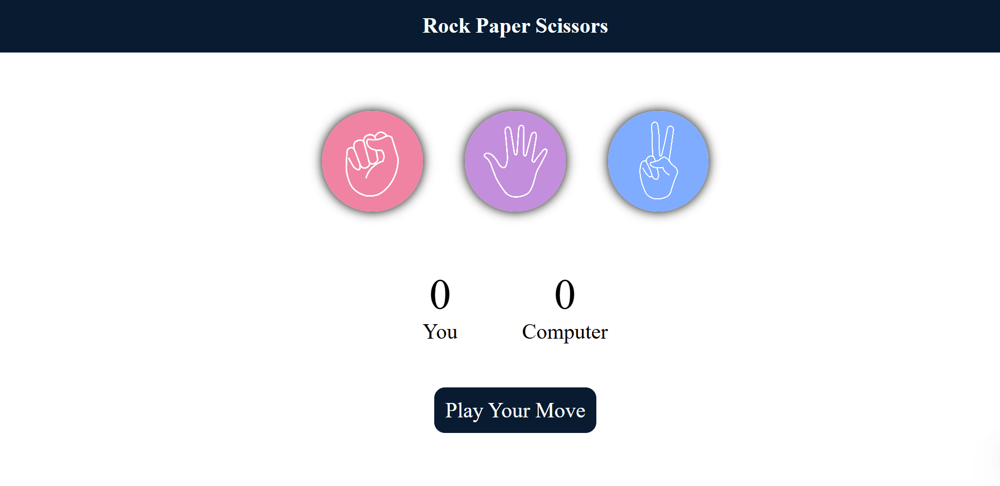

# 🪨📄✂️ Rock Paper Scissors Game

Welcome to the **Rock Paper Scissors Game**!  
Challenge your computer, watch your scores climb, and enjoy slick visuals, animations, and instant feedback—all in a modern browser experience.

---

## 🚀 Features

- **Interactive Choices:** Click rock, paper, or scissors with animated hover effects.
- **Dynamic Scoreboard:** Real-time score updates for you vs. the computer.
- **Instant Results:** Colorful pop-up messages for wins, losses, and draws.
- **Visual Feedback:** Glowing icons and background transitions amplify each round.
- **Responsive Design:** Looks great on desktops, tablets, and mobile.
- **Custom Assets:** Unique icons for each move—easily replaceable!
- **Sound Effects:** (Optional) Add your own for punches and wins.
- **Easy to Customize:** Tweak rules, images, styles, or add themes.

---

## 🎮 How to Play

1. **Open `index.html`** in your browser.
2. **Choose your move**: Click on 🪨, 📄, or ✂️.
3. **Wait for the outcome**: The computer randomly picks its move.
4. **React to the result**: The message box flashes with victory, defeat, or draw.
5. **Track the score**: See who’s ahead—and go for a winning streak!

---

## 🖼️ Demo

  

---

## 🗂️ Project Structure

```
├── index.html      # Main HTML file
├── style.css       # Game styles & animations
├── Script.js       # Game logic and interactivity
└── assets/
    ├── rock.png
    ├── paper.png
    └── scissors.png
```

---

## ✨ Customization Tips

- **Swap Icons:** Drop new images into `assets/`.
- **Add Sound:** Enhance the fun—play sound effects in `Script.js`.
- **Style It Up:** Change colors, fonts, or add animations in `style.css`.
- **New Rules:** Want “Lizard” or “Spock”? Expand the logic in `Script.js`!

---

## 💡 Code Highlights

- **Animated Hover:** Icons light up when hovered—makes picking more fun!
- **Color Feedback:** Win = green, Lose = red, Draw = yellow.
- **Score Tracking:** Instantly see your score and the computer’s.

> **Note:**  
> There’s a small typo in the code!  
> In the `playGame` function, change `userWind` to `userWin` for correct results:

```js
// Fix this line:
userWind = compChoice ==="paper" ? false : true
// To:
userWin = compChoice ==="paper" ? false : true
```

---

## 🌐 Browser Compatibility

Works on all modern browsers—Chrome, Firefox, Edge, Safari.

---

## 📜 License

Open-source and free for everyone!  
Remix, improve, or use as a learning project.

---

## 💬 Feedback

Found a bug or have a cool idea?  
Feel free to open an issue or contribute!

---

**Enjoy the game, challenge your friends, and may the best player win!**

---

**Made by ❤️ Subhrajeet Bhoi**